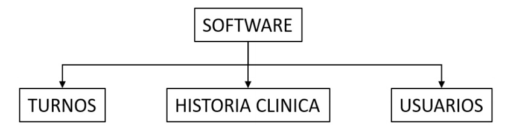
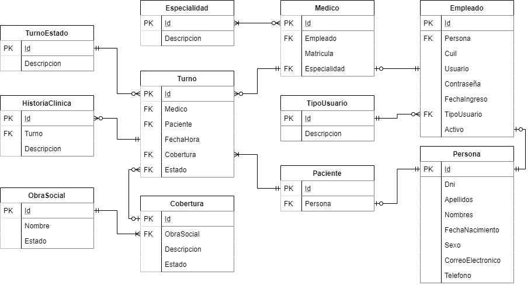

Taller de Programación II - 2020

Licenciatura en Sistemas de Información

UNNE - FaCENA

---

**Proyecto**: MediTurno

**Alumno**: Aguirre, Gonzalo Adolfo

# Especificación de requerimientos

## Introducción

### Propósito

- Describir de forma completa el comportamiento del sistema a desarrollar, detallando las
  interacciones que tendrán los usuarios del software.
- Establecer las bases de acuerdo entre cliente y desarrolladores en lo que al proyecto de software se refiere.

### Alcance

- Identificación del producto de software MediTurno.
- Objetivos del Sistema:
  - Obtener turnos de atención médica.
  - Visualizar la historia clínica de los pacientes.
  - Permitir la gestión de doctores, secretarios y pacientes.

### Definiciones, acrónimos y abreviaturas

**Software**: conjunto de programas que permiten a la computadora realizar determinadas tareas.

**Turno**: cita de atención médica.

**Sistema operativo**: conjunto de programas que administran los recursos de los sistemas, gestionan los componentes físicos y la interacción con el usuario.

## Descripción general

### Perspectiva del producto

El sistema a desarrollar es un producto independiente, y estará conformado por módulos que gestionaran el comportamiento de las distintas áreas y su comunicación con los módulos adyacentes.

### Funcionalidad del producto

El sistema permitirá:

- Administrar turnos para pacientes.
- Gestionar agenda de turnos de los médicos.
- Administrar historia clínica de los pacientes.
- Administrar usuarios del sistema (administrador, gerentes, médicos y secretarios)

### Características de los usuarios

| Tipo de usuario    | Formación (nivel educativo) | Experiencia y Especialización técnica                                                                           |
| ------------------ | --------------------------- | --------------------------------------------------------------------------------------------------------------- |
| Médico             | Educación superior          | Conocimiento básico sobre el uso de computadoras                                                                |
| Secretario         | Educación secundaria        | Conocimiento básico sobre el uso de computadoras; y experiencia con programas de gestión de agendas y personal. |
| Administrador      | Educación superior          | Conocimiento básico sobre el uso de computadoras; y experiencia con programas de gestión de agendas y personal. |
| SuperAdministrador | Educación superior          | Conocimiento de Bases de Datos Relacionales y Manejo de las mismas.                                             |
| Gerente            | Educación superior          | Conocimiento sobre estadísticas.                                                                                |

### Restricciones

El sistema debe ser desarrollado utilizando la metodología ágil Scrum y funcionar correctamente los sistemas operativos Windows 7, 8, 8.1 y 10.

### Suposiciones y dependencias

Se asume que cada secretario del sistema es poseedor de una computadora con alguno de los sistemas operativos mencionados en la sección 2.4 Restricciones. La tenencia de computadoras particulares compatibles por parte de los médicos, no es necesaria. Pero en el caso de que no posean, debe haber al menos una computadora común entre los médicos.

### Modelo de la Base de Datos

## Requisitos específicos

### Requisitos funcionales

| Nº de requisito | Descripción del requisito                                                                                                                                          |
| --------------- | ------------------------------------------------------------------------------------------------------------------------------------------------------------------ |
| RF#01           | El sistema debe permitir registrar un turno para el paciente con su DNI o nombre, médico con el que se desea atender, cobertura, fecha y horario de la misma.      |
| RF#02           | El sistema debe permitir la modificación de un turno existente.                                                                                                    |
| RF#03           | El sistema debe permitir dar de baja lógica un turno, eliminándolo de la agenda del médico correspondiente.                                                        |
| RF#04           | El sistema debe permitir la visualización de la agenda de un médico en específico, desde la cuenta del mismo.                                                      |
| RF#05           | El sistema debe permitir únicamente a un médico, la modificación de la historia clínica de un paciente.                                                            |
| RF#06           | El sistema debe permitir únicamente a un médico, la consulta de la historia clínica de un paciente.                                                                |
| RF#07           | El sistema debe dejar a disposición del médico la historia médica de los pacientes a atender.                                                                      |
| RF#08           | El sistema debe permitir registrar un médico con su apellido, nombre, DNI, email, número de teléfono, número de matrícula, área de atención, usuario y contraseña. |
| RF#09           | El sistema debe permitir modificar los datos de un médico existente.                                                                                               |
| RF#10           | El sistema debe permitir la baja de un médico existente, quitándolo de su cartilla.                                                                                |
| RF#11           | El sistema debe permitir registrar un secretario con su apellido, nombre, DNI, email, número de teléfono, usuario y contraseña.                                    |
| RF#12           | El sistema debe permitir modificar los datos de un secretario ya existente.                                                                                        |
| RF#13           | El sistema debe permitir dar de baja a un secretario, eliminando la cuenta con los permisos correspondientes.                                                      |
| RF#14           | El sistema debe permitir registrar un paciente con su apellido, nombre, DNI, número de obra social (si la posee), número de teléfono y correo electrónico.         |
| RF#15           | El sistema debe permitir modificar los datos de un paciente.                                                                                                       |

### Requisitos no funcionales

#### Requisitos del producto

| Nº de requisito | Descripción del requisito                                                                                                                                       | Clasificación            |
| --------------- | --------------------------------------------------------------------------------------------------------------------------------------------------------------- | ------------------------ |
| RNF#01          | El sistema debe responder a las peticiones en un máximo de 10 segundos, en máquinas con las prestaciones mínimas requeridas para el sistema operativo Windows 7 | Eficiencia - Rendimiento |
| RNF#02          | El sistema debe realizar copias de seguridad independientes del sistema operativo de la computadora que lo ha realizado.                                        | Portabilidad             |
| RNF#03          | El sistema debe poseer una interfaz gráfica intuitiva                                                                                                           | Usabilidad               |

#### Requisitos organizacionales

| Nº de requisito | Descripción del requisito                                                                      | Clasificación |
| --------------- | ---------------------------------------------------------------------------------------------- | ------------- |
| RNF#05          | El sistema ser finalizado en 4 meses.                                                          | Entrega       |
| RNF#06          | Se debe brindar una capacitación sobre la utilización del sistema a los secretarios y médicos. | Entrega       |

#### Requisitos externos

| Nº de requisito | Descripción del requisito                                                                                | Clasificación            |
| --------------- | -------------------------------------------------------------------------------------------------------- | ------------------------ |
| RNF#07          | El sistema debe comprobar las peticiones de recetas con la historia clínica del cliente.                 | Ético                    |
| RNF#08          | El sistema debe permitir la visualización de la historia clínica de un paciente, únicamente a un médico. | Legislativo - Privacidad |
